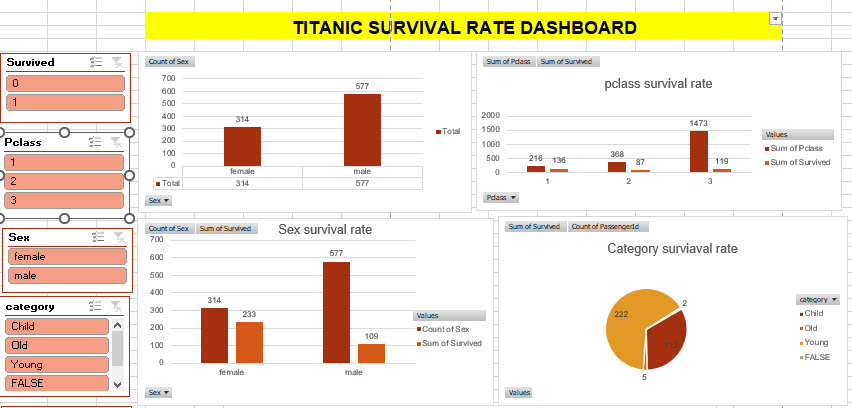

# Titanic Survival Prediction

This repository contains code and resources for predicting passenger survival on the Titanic using machine learning techniques.

## Overview

The Titanic dataset is a classic dataset in the field of machine learning. The goal of this project is to predict whether a passenger survived or not based on various features such as age, gender, class, and fare. The project follows a standard machine learning pipeline including data exploration, data cleaning, survival analysis, feature engineering, model building, evaluation, hyperparameter tuning, cross-validation, feature importance analysis, and visualization.

## Repository Structure

- **`Titanic-Dataset/`**: Contains the dataset file.
- **`Titanic.ipynb/`**: Jupyter notebook for data exploration, data cleaning, feature engineering, model building, and visualization, data preprocessing, model training, evaluation, and feature importance analysis.
- **`dashboard`**: Excel Dashboard to understand the survival rate using Pivot Charts.
- **`README.md`**: This file, containing an overview of the project and instructions for running the code.

## Data Exploration

Begin by exploring the dataset's basic statistics and visualizing distributions of key features like age and fare.

```
# Data Exploration
print("Basic Statistics of the Dataset:")
print(data.describe())

# Visualizing Age and Fare Distributions
sns.countplot(x=df['Sex'])
mt.show()
sns.countplot(x=df['Sex'],hue=df['Survived'])
sns.countplot(x=df['Embarked'],hue=df['Sex'])
mt.show()
sns.countplot(x=df['Pclass'])
mt.show()
sns.countplot(x=df['Pclass'],hue=df['Sex'])
mt.show()
sns.countplot(x=df['Parch'],hue=df['Survived'])
mt.show()
```

## Data Cleaning

Handle missing values, convert categorical variables into numerical format, and address outliers if necessary.
```
# Data Cleaning
# Handle missing values
data['Age'].fillna(data['Age'].mean(), inplace=True)
data['Embarked'].fillna(data['Embarked'].mode()[0], inplace=True)

```

## Survival Analysis

Calculate the overall survival rate and explore survival rates by gender, class, and age group.
```
print("Overall Survival Rate: {:.2f}%".format(data['Survived'].mean() * 100))
survival_by_gender = data.groupby('Sex')['Survived'].mean()
print("Survival Rate by Gender:")
print(survival_by_gender)
survival_by_class = data.groupby('Pclass')['Survived'].mean()
print("Survival Rate by Class:")
print(survival_by_class)
survival_by_age_group = data.groupby(pd.cut(data['Age'], bins=[0, 18, 35, 50, 80]))['Survived'].mean()
print("Survival Rate by Age Group:")
print(survival_by_age_group)

```
## Model Building

Choose a machine learning algorithm and train it on the data, aiming to predict passenger survival.
```

X = data.drop(['Survived', 'PassengerId'], axis=1)
y = data['Survived']
X_train, X_test, y_train, y_test = train_test_split(X, y, test_size=0.2, random_state=42)

model = RandomForestClassifier(random_state=42)
model.fit(X_train, y_train)

```

## Model Evaluation

Assess model performance using metrics such as accuracy, precision, recall, and F1-score.

```
# Model Evaluation
y_pred = model.predict(X_test)
accuracy = accuracy_score(y_test, y_pred)
precision = precision_score(y_test, y_pred)
recall = recall_score(y_test, y_pred)
f1 = f1_score(y_test, y_pred)
print("Model Evaluation Metrics:")
print("Accuracy: {:.2f}".format(accuracy))
print("Precision: {:.2f}".format(precision))
print("Recall: {:.2f}".format(recall))
print("F1 Score: {:.2f}".format(f1))
```

## Hyperparameter Tuning

Fine-tune model hyperparameters to optimize predictive accuracy.
```
# Hyperparameter Tuning (Grid Search)
param_grid = {
    'n_estimators': [50, 100, 150],
    'max_depth': [None, 10, 20],
    'min_samples_split': [2, 5, 10]
}
grid_search = GridSearchCV(estimator=model, param_grid=param_grid, cv=5)
grid_search.fit(X_train, y_train)
best_params = grid_search.best_params_
print("Best Hyperparameters:", best_params)
```
## Cross-Validation

Ensure the model's generalizability by using cross-validation techniques.
```
# Cross-Validation
cv_scores = cross_val_score(grid_search, X, y, cv=5)
print("Cross-Validation Scores:", cv_scores)
```
## Feature Importance

Identify which features have the most significant impact on survival prediction.
```
# Feature Importance
feature_importances = grid_search.best_estimator_.feature_importances_
features = X.columns
sorted_idx = np.argsort(feature_importances)[::-1]
print("Feature Importance:")
for idx in sorted_idx:
    print(features[idx], ":", feature_importances[idx])
```
## Visualization and Interpretation

Create visualizations to explore relationships between variables and summarize key findings to gain insights into factors influencing passenger survival.
```
# Visualization and Interpretation
plt.figure(figsize=(10, 6))
plt.barh(range(len(features)), feature_importances[sorted_idx], align='center')
plt.yticks(range(len(features)), np.array(features)[sorted_idx])
plt.xlabel('Feature Importance')
plt.title('Feature Importance - Random Forest')
plt.show()
```
## Dashboard



## Running the Code

1. **Clone this repository:**
git clone https://github.com/viditapawan/Titanic_Survival_Rate.git


2. **Navigate to the project directory:**
cd Titanic_Survival_Rate


3. **Install the required dependencies:**
pip install -r requirements.txt


4. **Run the Jupyter notebook `Titanic.ipynb` to explore the data, train the model, and create visualizations.**

Feel free to modify the code and experiment with different algorithms and features to improve the model's performance. Happy coding!
